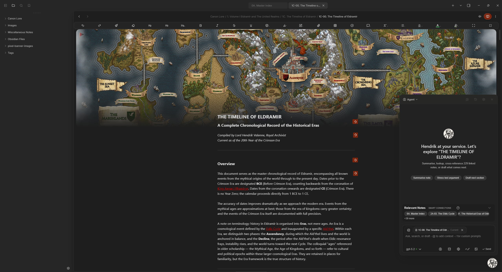

<h1 align="center">Hendrik The Medieval AI Archivist</h1>

<h2 align="center">
An AI companion for your Obsidian vault, built for control and craft
</h2>

  
  

  <a href="https://github.com/jakebiddle/Hendrik">Documentation</a> |
  <a href="https://github.com/jakebiddle/Hendrik/issues/new?template=bug_report.md">Report Bug</a> |
  <a href="https://github.com/jakebiddle/Hendrik/issues/new?template=feature_request.md">Request Feature</a>

  

## What Is Hendrik?

Hendrik The Medieval AI Archivist is an in-vault AI assistant for Obsidian. It pairs fast, local-friendly search with model-agnostic chat, structured context handling, and optional autonomous tool calling. Hendrik is designed for people who want their knowledge base to stay portable, private, and useful across models and workflows.

## Why It Exists

Model providers change prices, rules, and access. Hendrik keeps you in control by letting you bring your own models, store knowledge locally, and keep your workflow consistent even as providers change. Your vault stays yours, and the assistant grows with it.

## Current Highlights

- **Model-agnostic by design**: Use OpenAI-compatible APIs, local models, or custom endpoints.
- **Smart vault search with optional embeddings**: Immediate keyword-based search, with semantic search available when you enable indexing.
- **Context-aware chat**: Add notes, selected text, URLs, files, and more using `@` context references.
- **Composer and Quick Commands**: Apply edits and transformations with one click or quick actions.
- **Project Mode with isolated history**: Keep separate chat histories and contexts per project.
- **Multimodal support**: Analyze images, PDFs, EPUBs, and web pages from inside your vault.
- **Agent Mode**: Autonomous tool calling across vault search, web, and file operations.

## Get Started

### Install Hendrik

1. Open **Obsidian → Settings → Community plugins**.
2. Turn off **Safe mode** (if enabled).
3. Click **Browse**, search for **"Hendrik The Medieval AI Archivist"**.
4. Click **Install**, then **Enable**.

### Configure Providers

1. Go to **Obsidian → Settings → Hendrik → AI Settings** and click **Set Keys**.
2. Choose your AI provider(s) (OpenRouter, Gemini, OpenAI, Anthropic, Cohere, or local) and paste your API key(s).

## Quick Usage

- **Chat with a note**: Type `@` to add a note or selection into context and ask a question.
- **Vault-wide Index & Semantic Search**: Ask questions against your vault with built in semantic search and Smart Connection Plugin Compatability.
- **Command Palette**: Type `/` in chat or right-click selected text for quick actions.
- **Project Mode**: Scope conversations to folders or tags to keep context clean.
- **Agent Mode**: Ask for a result; Hendrik chooses the right tools automatically.

## Privacy and Control

- **All features included**: Messages and notes are sent only to your configured model provider.
- **Local processing**: File conversions (PDF, DOCX, EPUB, images) run locally when you explicitly trigger them via `@` commands.
- **No retention by default**: Data is processed to deliver the feature and then discarded.

## FAQ

  
<strong>Why is vault search missing notes?</strong>

If you rely on semantic search, make sure your embedding model is configured and indexing is up to date. For quick recall without embeddings, use the default vault search mode and add specific notes with `@`.

  
<strong>Why am I seeing error 429 or quota errors?</strong>

Your model provider likely needs billing enabled or you have hit a usage limit. Check your provider dashboard for quota or payment configuration.

  
<strong>Why am I hitting token limits?</strong>

Reduce max completion tokens, shorten your request, or move large context into `@` references so the model has more room for output.

